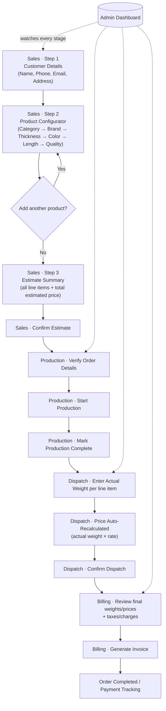
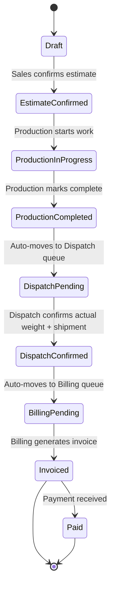
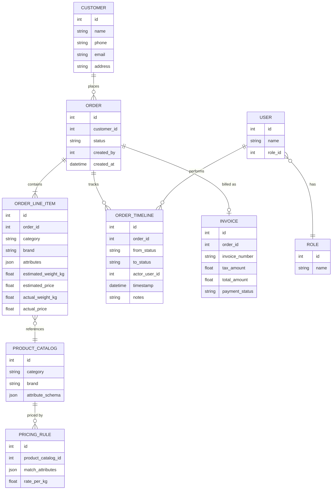

# Hindustan Roofs CRM — Architecture

A role-based CRM covering the full order lifecycle: **Sales (estimation) → Production → Dispatch → Billing**, with **Admin** having cross-cutting visibility into every order at every stage.

---

## 1. Roles & Responsibilities

| Role | Primary job | Can do |
|---|---|---|
| **Sales** | Capture customer + generate price estimate | Create customer, build multi-product estimate, confirm estimate → sends to Production |
| **Production** | Verify order, run production | View confirmed orders, verify line items, start/complete production → sends to Dispatch |
| **Dispatch** | Ship goods, true up weight/price | View production-complete orders, enter **actual weight**, system recalculates price, confirm dispatch → sends to Billing |
| **Billing** | Finalize money | View dispatched orders, apply taxes/charges, generate invoice, track payment |
| **Admin** | Oversight | Read access to every order + full timeline across all stages, manages users, product catalog, and pricing formulas |

Each role only sees its own work queue (orders currently sitting at their stage) except Admin, who sees everything.

---

## 2. End-to-End Flow



---

## 3. Order Status State Machine

Each order carries one status at a time. This status is what drives which role's queue it shows up in, and what Admin's timeline view is built from.



Every transition writes a row to an **Order Timeline / Audit Log** (order_id, from_status, to_status, actor_user_id, timestamp, notes) — this is exactly what feeds Admin's "which phase is this customer in" view.

---

## 4. Sales Module — Page-by-Page

### Page 1 — Customer Intake
Fields: Name, Phone, Email, Address. On submit → creates a `Customer` record (or matches an existing one by phone) and a new `Order` in `Draft` status, then routes to Page 2.

### Page 2 — Product Configurator (repeatable)
A **cascading selector**, one step unlocking the next:

```
Category  →  Brand  →  Thickness  →  Color  →  Length  →  Quality/Grade
(Sheets / Pipes /
 Fencing Wire /
 Ventilation Fans /
 Screws)
```

Important design point: **the attribute chain is not identical for every category.** Sheets need Brand→Thickness→Color→Length→Quality, but Pipes need Brand→Size→Thickness→Length, Fencing Wire needs Brand→Gauge→Length, and Fans/Screws need Brand→Model/Size only. So the configurator should be **config-driven** (each category defines its own ordered attribute list in the Product Catalog), not hardcoded — otherwise every new category requires a code change.

As soon as enough attributes are picked to resolve a **Pricing Rule**, the page shows a live **estimated weight** and **estimated price** for that line item (see §6, Pricing Engine). An "Add another product" button pushes the current line into a running cart and resets the configurator for the next item — this is how multiple products land on one estimate.

### Page 3 — Estimate Summary
Shows: customer details, every line item (category/brand/thickness/color/length/quality/qty/est. weight/est. price), and a grand total. Sales can edit quantities or remove lines here. **Confirm Estimate** button:
- Locks the estimate (no more edits by Sales),
- Sets order status → `EstimateConfirmed`,
- Sends the order into the Production queue.

---

## 5. Production Module

- **Queue view:** all orders in `EstimateConfirmed`.
- **Order detail view:** read-only customer + line-item details (what was sold), a verification checklist, **Start Production** button (→ `ProductionInProgress`), and **Mark Complete** button (→ `ProductionCompleted`, auto-advances to Dispatch queue).
- Optional: production notes/remarks field per order for internal tracking (e.g. delays, material substitutions).

---

## 6. Dispatch Module — the weight-correction step

- **Queue view:** all orders in `DispatchPending`.
- **Order detail view:** every line item shows its **estimated weight** (from Sales) next to an **editable "actual weight" field**.
- The moment Dispatch edits a weight, the **same pricing formula** used at Sales re-runs with the new weight, producing an **actual price** per line and a variance vs. the original estimate (so it's visible if the final bill is going up or down and by how much).
- **Confirm Dispatch** button: locks actual weights/prices, records dispatch metadata (vehicle no., dispatch date, driver, etc. — fields TBD with client), sets status → `DispatchConfirmed`, auto-advances to Billing queue.

---

## 7. Billing Module

- **Queue view:** all orders in `BillingPending`.
- **Order detail view:** final weights/prices from Dispatch, plus billing-only fields: taxes (GST), transport/loading charges, discounts, payment terms.
- **Generate Invoice** button: creates an `Invoice` record with an invoice number, produces a PDF, sets status → `Invoiced`.
- Payment tracking: mark `Paid` / `Partially Paid` / `Unpaid`, with amount and date received.

---

## 8. Admin Module

- **All-orders dashboard**, filterable by stage (Estimation / Production / Dispatch / Billing / Completed), by sales rep, by date range, by customer.
- **Per-order timeline**: every status transition with who did it and when (built directly off the audit log from §3) — answers "where is this customer's order right now" at a glance.
- **Product & Pricing management:** CRUD on categories, brands, and their attribute chains (thickness/color/length/quality options), and the pricing formulas/rates behind them (§6 below) — this is how the business updates rates without needing a developer.
- **User management:** create/deactivate Sales/Production/Dispatch/Billing accounts, assign roles.
- **Reports:** orders by stage-aging (e.g. "stuck in Production > 3 days"), revenue by rep/brand/period, pending payments.

---

## 9. Pricing Engine

Price is always **weight × rate**, where weight is either the Sales-side *estimate* or the Dispatch-side *actual*. The engine needs two configurable pieces, both owned by Admin:

**a) Weight formula per category** (standard industry formulas, used as sensible defaults):

| Category | Formula |
|---|---|
| Sheets | `weight_kg = length_m × width_m × thickness_mm × 7.85` (steel density factor) |
| Pipes | `weight_kg_per_m = 0.02466 × t_mm × (OD_mm − t_mm)` |
| Fencing wire | `weight_kg_per_m = 0.006165 × diameter_mm²` |
| Fans / Screws | Fixed weight/price per unit (no formula needed — priced per piece) |

**b) Rate table**, keyed by `category + brand + thickness/grade + quality`, giving `rate_per_kg` (or `rate_per_piece` for fans/screws), managed entirely in the Admin catalog UI — this is exactly the "input a formula and prices in the backend" requirement.

`estimated_price = estimated_weight × rate_per_kg` at Sales; `actual_price = actual_weight × rate_per_kg` at Dispatch (same rate, corrected weight).

---

## 10. Data Model (core entities)



---

## 11. Permission Matrix

| Action | Sales | Production | Dispatch | Billing | Admin |
|---|:---:|:---:|:---:|:---:|:---:|
| Create customer / estimate | ✅ | – | – | – | ✅ |
| Edit product selection & pricing (pre-confirm) | ✅ | – | – | – | ✅ |
| Confirm estimate | ✅ | – | – | – | ✅ |
| View own-stage queue | ✅ | ✅ | ✅ | ✅ | ✅ (all) |
| Start / complete production | – | ✅ | – | – | ✅ |
| Edit actual weight | – | – | ✅ | – | ✅ |
| Confirm dispatch | – | – | ✅ | – | ✅ |
| Generate invoice | – | – | – | ✅ | ✅ |
| Mark payment status | – | – | – | ✅ | ✅ |
| View all orders / full timeline | – | – | – | – | ✅ |
| Manage product catalog & pricing rules | – | – | – | – | ✅ |
| Manage users/roles | – | – | – | – | ✅ |

---

## 12. Suggested Tech Stack

The existing repo (`3Dwebdesign`) is a marketing/portfolio site (React 19 + Vite + Tailwind, no backend) — the CRM should be a **separate application**, not bolted onto it. Recommendation, open to change:

- **Frontend:** React + Vite + Tailwind (keeps the team's existing skillset), React Router for the multi-step Sales flow, a lightweight state store (Zustand) for the in-progress estimate/cart.
- **Backend:** Node.js (Express/Fastify) REST API, JWT-based auth with role claims.
- **Database:** PostgreSQL — relational fits the Customer/Order/LineItem/Invoice structure well; `attributes`/`attribute_schema` columns as JSON for the per-category variant fields.
- **File storage:** invoice PDFs to S3-compatible storage.
- **Real-time (optional, phase 2):** WebSocket push so Admin's dashboard and the next role's queue update live the moment a status changes, instead of needing a refresh.

---

## 13. Open Questions for the Client

1. Should the customer themselves ever see/receive the estimate (e.g. emailed PDF), or is this purely internal (Sales rep-facing)?
2. Dispatch metadata — what fields matter (vehicle number, driver, transporter, delivery address if different from billing address)?
3. Can Production or Dispatch **reject/send back** an order (e.g. wrong spec caught at Production), or is the flow strictly one-directional?
4. Multiple invoices per order (partial dispatch/partial billing) or always one invoice per order?
5. Discounts/negotiated rates — does Sales get any override power on the estimate, or is pricing strictly formula-driven?
